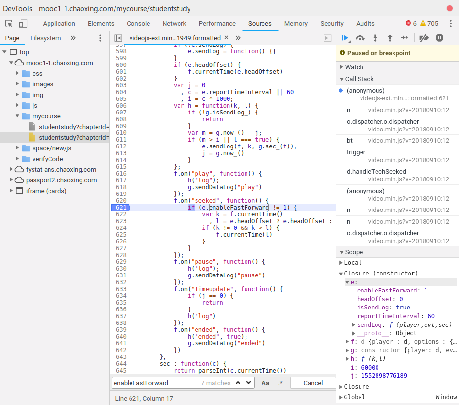

# 在 `halnedu.com` 上高效学习

## 准备工具

* 健康的大学生
* 桌面操作系统（Windows™，MacOS™ 和 *nix 系均可）
* 靠谱的浏览器（下面以 Google Chrome 72 为例）
* 上课的笔记本（逃

## 学习步骤

* 打开浏览器

* 进入学习网址

* 登录

* 进入学习

* 进入课程

* 点击还没有学习的课程

* 掏出笔记本，准备认真学习

* 按下 `F12` 打开 Google Chrome 的 DevTools

* 进入 `Sources`（源代码）

* 按下 `Ctrl + P`，打开文件搜索 

* 输入 `videojs-ext`，选择第一个文件进入

* 此时会看到该文件内容。点击左下角的格式化代码（`{}`）

* 现在代码能看了

* 按下 `Ctrl + F` 打开搜索。输入 `_disableSeek`，找到第 qwq 行

* 单击 qwq 这个行号设置断点

* 按下 `Ctrl + F` 后输入 `enableFastForward`，找到第 621 行

* 单击 621 这个行号设置端点

* 回到原来的浏览器，点击红色框内的进度条

* 此时 Google Chrome 的 DevTools 窗口会自动弹出，并且会定位到第 qwq 行

* 点击红框内的文字，找到 `_disableSeek`

* 双击 `true` 后将其修改为 `false`

* 按下 `Enter` 键确定

* 按下 `F8` 继续。 DevTools 会继续定位到第 621 行。点击红框内倒三角符号收起 `local` 一栏

* 从上至下依次点击红框内文字，看到 `enableFastForward`

* 双击 `0` 并将其修改为 `1`

* `Enter` 键确认

* 按下 `F8` 继续，回到原浏览器窗口。学习完成，收好自己的笔记本以备复习

* 按时完成作业愉悦身心、增长见识

* 享受快乐学习

## 提示

1. 请勿爆肝学习，注意身体健康。合理学习益脑，过度学习伤身
2. 提 Issue 很可能没用。欢迎 Pull Request